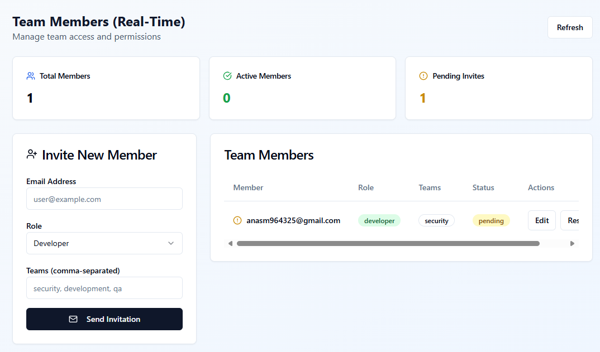
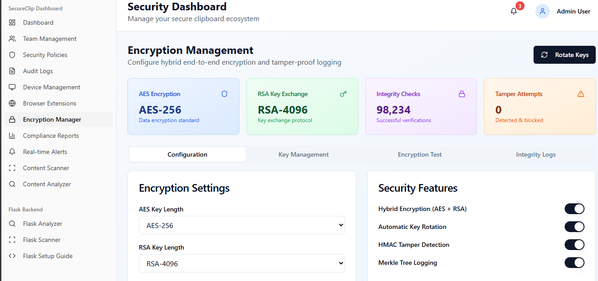
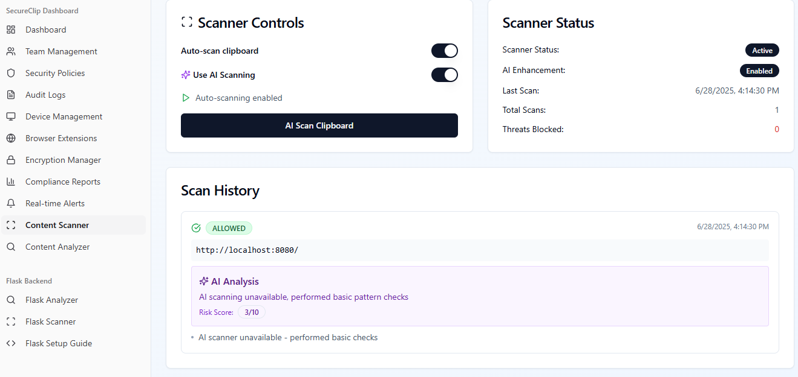
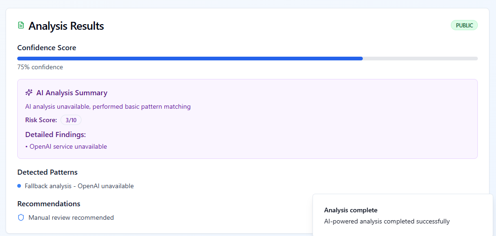

# 🔐 Secure Clip

> 🧠 Secure Clipboard Ecosystem 
A full-stack, enterprise-grade clipboard management system for 🔒 secure synchronization, 🤖 AI-powered content analysis, and 🧾 domain-based policy enforcement — across devices & applications.

> ## 🔥 Why Secure Clip?

Tired of unmonitored clipboard data leaks and risky pasting behavior?  
**Secure Clip** ensures intelligent sync, protection, and full visibility — for teams that care about security.
## 🖼️ UI Screenshots

Get a quick look at Secure Clip's real-time, secure clipboard management features 👇

---

### 📊 Dashboard Overview



---

### 🔐 Security & Policy View



---

### 🧠 Clipboard Content Analysis (AI)



---

### 👥 Team & Role Management


---

### 📁 GitHub Repository Structure



 
## ✨ Features

### 🔐 Security & Encryption
- 🔒 End-to-end encryption using **AES-256 + RSA-4096** hybrid model  
- 🧩 Device-based authentication with secure fingerprinting  
- 🛂 Role-based access control (**Admin, Developer, Viewer**)  
- 🧾 HMAC-signed audit logs for tamper-proof security tracking  

---

### 🤖 AI-Powered Analysis
- ⚡ Real-time content classification using **OpenAI GPT-4o-mini**  
- 🛡️ Threat detection and security risk assessment  
- 📜 Automated policy enforcement based on content analysis  
- 💡 Smart content recommendations and safety scoring  

---

### 📊 Management Dashboard
- 📈 Real-time security metrics and threat monitoring  
- 👥 Team management with invitation system  
- 💻 Device management and activity tracking  
- 🧮 Compliance reporting with automated audit trails  
- 🌐 Browser extension monitoring and control  

---

### 🔄 Synchronization
- 🔁 Cross-device clipboard sync with real-time updates  
- 🕒 Content expiration and retention policies  
- 🧰 Domain-based filtering and application controls  
- 🧪 Paste validation with policy enforcement  

## 🏗️ Project Architecture

The system is structured into three main layers:

---

### 🧠 Backend — `backend/`

- **`app.py`** – Main Flask entry point  
- **`config.py`** – Firebase and API key setup  
- **`controllers/`** – Route handlers  
  - `auth_controller.py` – Login, registration, role-based auth  
  - `clipboard_controller.py` – Clipboard sync APIs  
  - `ai_controller.py` – OpenAI content analysis  
  - `device_controller.py` – Device authentication and fingerprinting  
  - `logs_controller.py` – Audit logs and tracking  
- **`services/`** – Business logic layer  
  - `firebase_service.py` – Firebase DB/auth setup  
  - `encryption_service.py` – AES + RSA hybrid logic  
  - `policy_service.py` – Domain/app rule enforcement  
- **`utils/`** – Reusable utilities  
  - `auth_utils.py` – Token checkers, decorators  
  - `logger.py` – Activity/event logging  
- **`credential.json`** – 🔐 Firebase service account key  
- **`requirements.txt`** – Python dependencies  

---

### 💻 Frontend — `frontend/`

- **`public/`** – Static assets  
- **`src/`** – Core React + TS code  
  - `App.tsx` – App entry point  
  - `index.tsx` – ReactDOM root render  
  - **`components/`** – UI Components  
    - `AppSidebar.tsx`, `ClipboardDashboard.tsx`, `ContentAnalyzer.tsx`, etc.  
    - `ui/` – ShadCN & custom design components  
  - **`pages/`** – Route-level UIs  
    - `Dashboard.tsx`, `Login.tsx`, `Settings.tsx`  
  - **`services/`** – API handlers  
    - `api.ts`, `auth.ts`, `clipboard.ts`  
  - **`context/`** – Global state (user, auth)  
  - **`hooks/`** – Custom React hooks  
  - **`utils/`** – Helper functions  
- **`.env`** – Frontend environment vars  
- **`tailwind.config.js`** – Tailwind setup  
- **`package.json`** – Frontend dependencies  

---

### 🌐 Root Project

- **`.env`** – Global environment vars  
- **`README.md`** – 📄 Project guide and documentation  


## 🚀 System Overview

### 👥 Users & Devices
- 🔐 Secure user authentication & role-based access
- 📱 Device registration with encrypted key management

### 📋 Clipboard Sync
- 🧩 End-to-end encrypted clipboard entries
- 🔒 Zero-knowledge architecture — server can't decrypt
- 🔁 Real-time cross-device clipboard synchronization

---

## 🔐 Security Features

### 🛡️ Encryption
- 🔒 Client-side AES-256 + RSA hybrid encryption
- ♻️ Secure key rotation & management
- 🚫 Server has zero access to decrypted content

### 📈 Monitoring
- 🤖 AI-based threat & anomaly detection
- 🧠 GPT-4o-mini for live content analysis
- 🧾 Cryptographically signed audit logs

### 🧰 Policy Enforcement
- 🌐 Domain & app whitelisting/blacklisting
- 🚦 Auto-blocking based on content classification
- 👮 Role-based controls for secure team workflows

---

## 📊 Dashboard & Reporting

- 📡 Live device status, sync stats, & security score
- 🧩 Policy violation alerts & activity tracking
- 📄 Exportable reports for GDPR, HIPAA, SOX compliance

## 🛠️ Getting Started

Follow these steps to set up and run the project locally:

---

### 📥 1. Clone the Repository

```bash
git clone <repository-url>
cd secure-clip

Install Dependencies
npm install ---> frontend is running on http://localhost:8080/

Set Up Environment Variables inside (.env)
DATABASE_URL=your_neon_postgresql_url
OPENAI_API_KEY=your_openai_api_key
AUDIT_LOG_SECRET=your_secret_for_hmac_signatures

for backend
pip install -r requirements.txt

Initialize the Database
npm run db:push

> Now start the Backend Server
python app.py --> backend running at  http://localhost:5000


